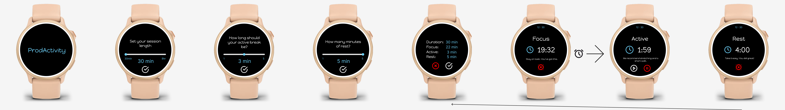

# ProdActivity Garmin App

A productivity timer app for Garmin Connect IQ devices.

## Inspiration
I built this app to help myself stay focused during work sessions — especially when balancing screen time with physical movement. I liked the idea of a Pomodoro-style timer on my watch, but with a twist: alternating between focused work, light activity, and quiet rest to encourage both mental clarity and physical reset.

This project also served as a way to explore Monkey C and the Garmin Connect IQ SDK. I wanted a hands-on experience building something from scratch, rather than following a tutorial. It was a chance to learn how to manage view transitions, timers, and button input, while also designing for devices with limited UI capabilities and varying screen sizes.

I designed the initial layout in Figma before coding to visualize the flow and ensure a clean, user-friendly interface across screens.

## Compatibility & Supported Devices

- Designed and tested primarily on Garmin fenix 8 (47mm).
- Targets Connect IQ API version 5.1.1 and above.
- Some UI elements use hardcoded positioning. This approach is recognized as suboptimal and can be enhanced by adopting relative layout techniques (e.g., percentages of screen dimensions) to improve device compatibility.
- Assumes presence of physical buttons (Up, Down, Back, Enter); touchscreen-only and buttonless devices not fully supported.

## Installation

- Build using the Garmin Connect IQ SDK (version 5.1.1 or later).
- Deploy to device via Garmin Express or simulator.
- Compatible with fenix 8.

## Controls

- Use Up/Down buttons to adjust session length.
- Press Enter to confirm selection.
- Use Back button to cancel or go back.
- Use Back and Enter to pause/resume Timers.

## Features

- **Loading Screen:**  
  Custom loading view with centered title and background.

- **Session Duration Selection:**  
  Interactive screen to set your session length using a slider, with min/max labels and real-time updates.

- **Transitions:**  
  Smooth transitions between loading and main setup screens.

- **Consistent UI:**  
  Shared background drawing for a unified look across all screens.

- **Button Navigation:**  
  Use device buttons to adjust session length and confirm your choice.

## File Structure

- `source/ProdActivityApp.mc` - Main application logic.
- `source/delegates/NullDelegate.mc` - Null delegate placeholder.
- `source/delegates/SessionLengthDelegate.mc` - Handles input for session length view.
- `source/delegates/SummaryDelegate.mc` - Handles input for summary view.
- `source/delegates/TimerDelegate.mc` - Handles input for timer view.
- `source/utils/BackgroundUtils.mc` - Shared background drawing utilities.
- `source/utils/DurationLimits.mc` - Duration limit constants.
- `source/utils/DurationType.mc` - Duration type constants.
- `source/utils/SessionFlow.mc` - Defines the session flow logic.
- `source/utils/TimerFlow.mc` - Defines the timer flow logic.
- `source/views/LoadingView.mc` - Loading screen view.
- `source/views/SessionLengthView.mc` - Session duration selection view.
- `source/views/SummaryView.mc` - Summary screen view.
- `source/views/TimerView.mc` - Timer countdown and phase view.

## Future Additions
I would like to add/change:
  - Touch Controls
  - Refine Styling
  - Change hardcoded positioning of UI Elements
    - May not work on other watches
  - Track Avg HeartRate during Focus, Active, Rest
    - Can make sure you are getting higher Active HR than Focus HR.
  - Add vibration notifications to support users with hearing impairments or those who prefer silent alerts